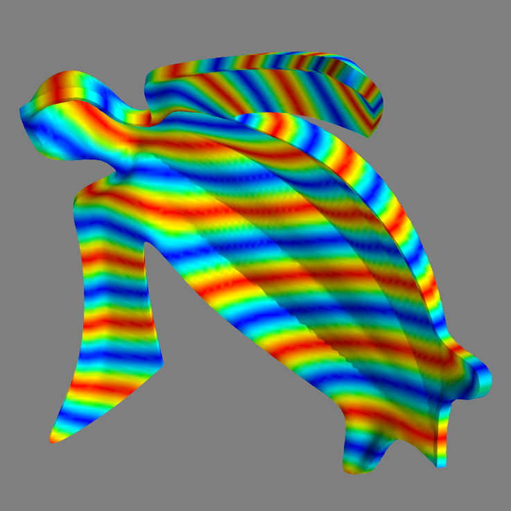

Escheresque provides a graphical editor to edit tilings of the sphere, over all possible symmetry groups.

For example, here are twelve identical leatherback turtles, on a Pyritohedral symmetry group

Parts can be extruded and exported for 3d printing

